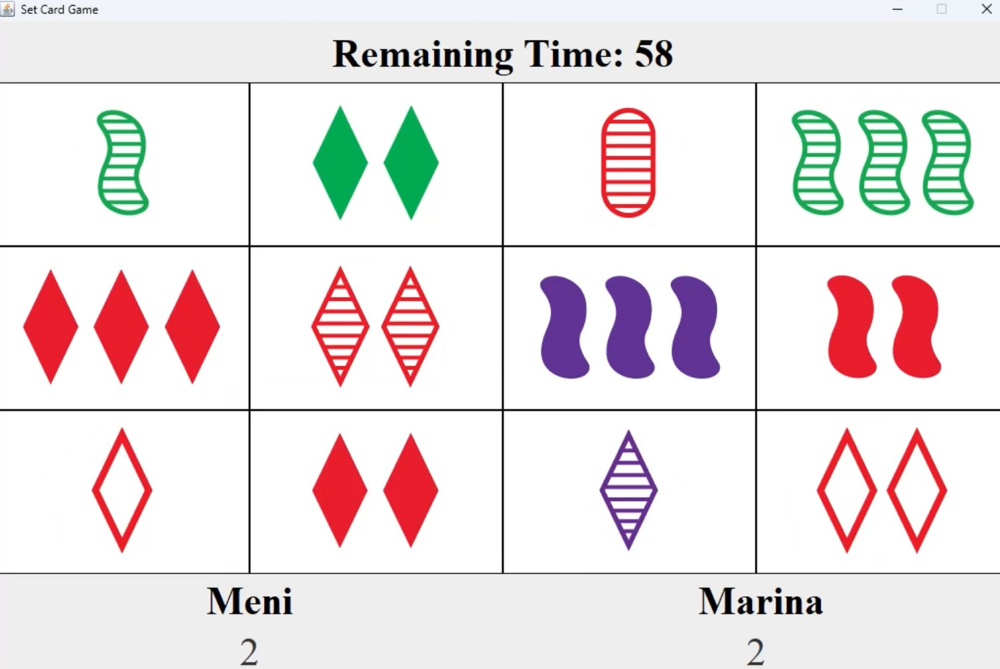

# Set Card Game 

A multi-threaded implementation of the **Set card game** written in Java.

This project was developed as part of a Systems Programming course and focuses on **concurrency, synchronization, and thread coordination** in Java.

The game simulates multiple players interacting with a shared table while a dealer thread manages the game flow.

---

## Game Overview

Set is a pattern-matching card game.

Each card has four features:

- Color
- Number of shapes
- Shape type
- Shading

A **legal set** is a group of three cards where for each feature the cards are either:

- all the same  
or  
- all different

If any feature has exactly two identical values and one different value, the set is invalid.

---

## Game Interface

The game runs with a graphical user interface.

Features of the UI:

- countdown timer
- table grid (3×4 cards)
- player score display
- keyboard input for player actions

Example game screen:



---

## System Architecture

The game is built using a concurrent architecture with multiple interacting threads.
The dealer manages the game flow while each player runs on a separate thread and interacts with the shared table.

```
           +------------------+
           |      Dealer      |
           |   (main thread)  |
           +------------------+
                    |
        -----------------------------
        |                           |
+------------------+       +------------------+
|     Player 1     |       |     Player 2     |
|      Thread      |       |      Thread      |
+------------------+       +------------------+
        |                           |
        -----------+----------------
                    |
              +-----------+
              |   Table   |
              | (shared)  |
              +-----------+
```


---

## Core Components

### Dealer

The **Dealer thread** controls the main game logic.

Responsibilities:

- dealing cards to the table
- managing the deck
- checking sets submitted by players
- handling penalties and points
- updating the game timer
- determining when the game ends

---

### Player

Each player runs on a **separate thread**.

Responsibilities:

- receiving key presses
- placing and removing tokens on cards
- submitting potential sets to the dealer
- handling freeze periods after penalties or scoring

Non-human players simulate random key presses.

---

### Table

Shared data structure used by the players and dealer.

Responsibilities:

- storing cards currently on the table
- tracking tokens placed by players
- synchronizing access between threads

---

### Cards

The deck contains **81 unique cards**.

Each card has four features with three possible values each.

Card IDs are computed based on feature combinations.

---

## Concurrency Design

This project demonstrates several concurrency principles:

- multiple threads running simultaneously
- synchronization between players and dealer
- fair handling of set validation requests (FIFO)
- safe access to shared resources (the table)

Proper synchronization is required to prevent:

- race conditions
- deadlocks
- inconsistent game state

---

## Build and Run

This project uses **Maven**.

Compile:


mvn compile


Run:


mvn exec:java


Clean project:


mvn clean


You can also run everything with:


mvn clean compile exec:java


---

## Project Structure

```
src/
└── main/java/bguspl/set/ex
    ├── Dealer.java
    ├── Player.java
    └── Table.java

src/test

pom.xml
```

---

## Technologies

- Java
- Multithreading
- Synchronization
- Maven
- Unit Testing
